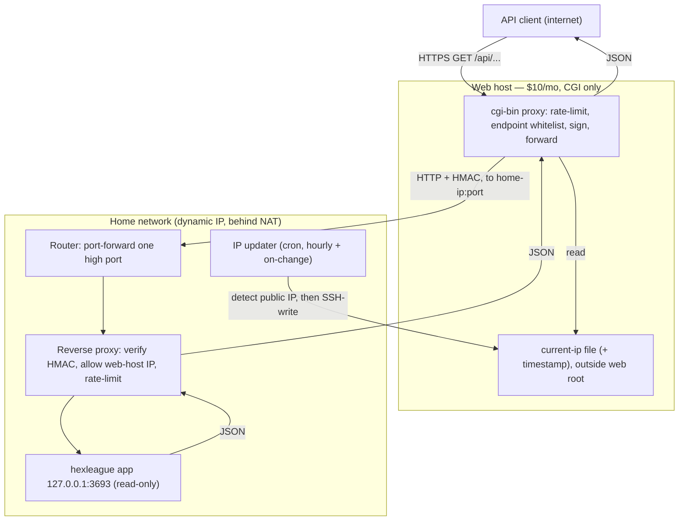

# Web-Hosted Frontend — Design Plan

**Status: design plan — not implemented.** This document captures the intended
architecture for exposing the app's read-only API to the public internet through
a cheap, CGI-capable web-hosting account, backed by the always-on home server
that actually runs the scans. Nothing here is built yet; it is a plan to work
from later.

## Goal

Let other applications call the sea-creature API over the public internet —
chiefly `GET /api/what-is-my-hex-staking-sea-creature` and
`GET /api/get-hex-staking-pool-sea-creature-data` — without exposing the home
server directly, without a static IP, and without paying for more than the
existing hosting. The public entry point is **rate-limited**, and only the
read-only endpoints are reachable.

## Constraints

These are the givens the design must satisfy:

- **Web host:** a ~$10/month shared account that supports **CGI** (`cgi-bin`,
  typically Perl or Python — not a long-running process). This is the only
  public-facing component.
- **No static IP** at home, and no willingness to pay for one. The home public
  IP is dynamic.
- **Passwordless SSH** from the home server to the web host is available.
- **Always-on home server** runs the `hexleague` app (the read-only dashboard/
  API on `127.0.0.1:3693`).
- The home server **pushes its current public IP to the web host once per hour**
  (a self-hosted dynamic-DNS), so an IP change causes at most a bounded outage.
- The web host, knowing the home IP, **forwards** API requests to it.
- The app stays **read-only** — no keys, no writes (see the project disclaimer).
  The public surface must never reach the scan-control endpoints.

## Architecture overview

Two independent flows: the **request path** (client → web host → home → back) and
the **IP-sync path** (home → web host, hourly).

## Components

### Home server

1. **The app, unchanged.** It keeps binding `127.0.0.1:3693` and stays read-only
   with no auth (its design invariant). Nothing public talks to it directly.
2. **A thin reverse proxy** (nginx or Caddy) is the only thing exposed via the
   router. It terminates the inbound connection, enforces auth and access
   control, then proxies to `127.0.0.1:3693`. Keeping auth here means the app
   itself never gains keys or write paths. Responsibilities:
   - Verify the per-request **HMAC signature** added by the CGI (shared secret).
   - Optionally allow only the web host's outbound IP(s) (defense in depth).
   - Enforce a local **rate limit** as a backstop.
   - Proxy only the whitelisted read-only paths through to the app.
3. **IP updater** (cron): detect the current public IP and push it to the web
   host. See [The dynamic-IP sync](#the-dynamic-ip-sync).
4. **Router port-forward:** forward one non-obvious high external port to the
   reverse proxy's LAN address. (Only the proxy port — never the app port.)

### Web host (CGI frontend)

A single `cgi-bin` script (language per what the host supports) that, per
request:

1. **Rate-limits** the client — see [Rate limiting](#rate-limiting). Over limit
   returns `429` with `Retry-After`.
2. **Validates and whitelists** the request: only specific read-only `GET`
   endpoints and their query parameters pass; everything else returns `404`.
3. **Reads the stored home IP** and its timestamp. If the timestamp is stale
   (home offline or IP not refreshed), it returns `503` instead of forwarding to
   a dead address — see [Failure modes](#failure-modes-and-outages).
4. **Signs and forwards** the request to `http://<home-ip>:<port>/api/...` with a
   short connect/read timeout, adding the HMAC header.
5. **Relays** the JSON response and status back to the client, setting sensible
   headers (`Content-Type: application/json`, a short `Cache-Control`, and CORS
   if browser callers are expected).

## The dynamic-IP sync

The self-hosted dynamic-DNS that lets the web host find the home server.

- **Detect** the public IP from the home side (e.g. an external echo service, or
  the router's WAN status). Compare to the last value pushed.
- **Push** it to the web host over the existing passwordless SSH, writing a small
  file the CGI reads — for example `current-ip.txt` containing the IP plus a UTC
  timestamp. Store it **outside the web root** so it is never served directly.
- **Cadence:** hourly via cron is the baseline (bounded ~1 h worst-case staleness
  on an IP change). To shrink the outage window, also push **on IP-change**
  (a NetworkManager dispatcher hook or a small watcher) and/or run every ~15 min
  — the push is tiny.
- **Lock down the SSH key:** use a forced command (`command="..."` in
  `authorized_keys`) so the key can only run the IP-writing script, nothing else.

## Rate limiting

The public rate limit lives in the CGI (the home proxy limit is a backstop).
Because CGI is per-request and stateless, it needs persistent counters:

- **Store** counters in a flat file or SQLite in the account's storage, keyed by
  client IP, guarded by `flock` to survive concurrent CGI invocations.
- **Algorithm:** a token bucket or sliding window per client IP (e.g. 60/min),
  plus a **global** cap to protect the home server's bandwidth and the app.
- **Response:** `429 Too Many Requests` with `Retry-After`. Consider also a small
  per-IP daily cap.

## Security

- **Whitelist read-only endpoints only.** Never forward `POST /api/update` or
  `/api/update/stop`; forward only the safe `GET` endpoints. The app is read-only
  by design, so the blast radius is small even if something slips — but the
  whitelist is the primary guard.
- **HMAC on the internal leg.** The CGI signs each forwarded request with a
  shared secret; the home proxy verifies it. Signing (rather than sending the
  secret) keeps the secret off the wire even though the leg is plain HTTP. The
  response payload is public read-only data, so confidentiality is not the
  concern — request authenticity and rate-limit-bypass prevention are.
- **Optional home IP allowlist:** restrict the proxy/firewall to the web host's
  outbound IP(s). Verify that outbound IP first (shared hosts may use a pool or a
  different IP than the site), so treat this as defense-in-depth, not the only
  lock.
- **Locked-down SSH key** (forced command) for the IP push.
- **Keep validation at the edge and the core:** the app already validates input
  (e.g. `tshares` to 8 decimals, rejecting the rest); the CGI should pass
  parameters through rather than reinterpret them.

## Failure modes and outages

- **Home offline / IP stale:** the CGI's freshness check returns `503` rather
  than hanging on a dead address. Surface a clear message.
- **CGNAT / no port-forward (prerequisite risk):** this design needs a *real*
  public IP with a forwardable port. If the ISP uses carrier-grade NAT, inbound
  port-forwarding is impossible and this approach cannot work as drawn — use a
  tunnel instead (see [Alternatives](#alternatives-considered)). Confirm this
  before building.
- **Optional resilience — cache last-good:** the underlying report changes at
  most daily, so the web host can cache the last successful
  `get-hex-staking-pool-sea-creature-data` response and serve it (marked stale)
  when the home server is unreachable. Turns a home outage into stale-but-up.

## Alternatives considered

- **Reverse SSH tunnel** (`ssh -R` from home to the web host): removes the need
  for a public IP, port-forwarding, and the IP push entirely — the web host
  reaches the home API over `localhost`. But it needs a **persistent process**
  on the web host, which cheap shared/CGI hosting usually forbids (long-running
  processes get killed). Viable only if the host permits it.
- **Cloudflare Tunnel / ngrok:** cleanly solves dynamic IP + NAT (including
  CGNAT) for free/cheap, but adds a third party and does not use the existing
  $10 account. A strong fallback if CGNAT rules out port-forwarding.
- **Commercial dynamic DNS** (DuckDNS, No-IP) + port-forward: replaces the
  SSH IP-push with a standard DDNS client, but still needs a forwardable port.
  The SSH-push here is essentially a self-hosted equivalent.

## Open decisions

- CGI language (Perl vs Python — whichever the host supports well).
- External/forwarded port number.
- Rate-limit numbers (per-IP, global, daily).
- Internal-leg protection: HMAC signing vs HTTPS on the home proxy.
- Response caching on the web host: on or off.
- Exact endpoint whitelist (the two named endpoints, plus perhaps `whereami`,
  `summary`, `health`, `openapi.json`).

## Rough milestones

1. Stand up the home reverse proxy and router port-forward; confirm the app is
   reachable from an external host over the public IP.
2. Write the IP updater (detect + SSH forced-command push); confirm the web host
   file updates hourly and on change.
3. CGI proxy MVP: read the stored IP, forward one endpoint, relay JSON.
4. Add the endpoint whitelist and parameter pass-through.
5. Add rate limiting (per-IP + global) with `429`/`Retry-After`.
6. Add freshness/staleness handling and error mapping (`503`, `502`, `404`).
7. Add HMAC signing + verification on the internal leg.
8. Optional: response caching, on-change IP push, and basic monitoring.

---

[← Back to the README](../README.md)
